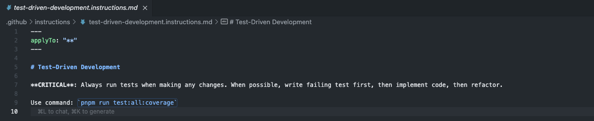

<!-- _class: lead -->

# **"Agentic" coding tools**

## _Let the AI code for you... (sort of)_

---

# What is Agent Mode?

<!-- _class: invert -->

An AI coding assistant mode where you **describe a high-level task** and the AI autonomously plans and applies the needed code changes across your project.

---

# Use cases

- Refactoring code (turn this block of code into a function)
- Adding a new features (add zoom boundaries to this interactive map)
- Migrating to a new framework (migrate this code from Pandas to Polars)
- Vibecoding internal tools (build me a streamlit app for data entry)
- Learning new technologies (help me understand this new API/library/etc).

---

# How Agent Mode Works

Agent mode can take more complex multi-step actions than tab completions or regular ChatGPT.

It has access to your entire codebase, and can run terminal commands and use various tools to see the output of our code and check for errors.

---

# Agent Workflow

1. **Reason** → Understand the task
2. **Act** → Use tools to make changes
3. **Observe** → Check results and adjust

---

# Tools

- Agents use **tools** (functions with JSON in/out) to act.
- They decide when to call them, provide inputs, and use outputs to continue.

---

# MCP Servers

MCP (model context protocol) is standard way for agents to connect to external data and tools. They give agents groups of tools to work with.

---

# The Context Problem

LLMs can handle huge context, but too much slows them down.

The solution:

- Give the agents lots of info they do need
- Minimize irrelevant context

---

# Rules

Custom instructions injected into agent's context to control behavior.

Can be provided for all requests, or based on certain files and conditions.

---

# Example rule: test-driven development

---

# Example rule: GitHub Usage

---

# Modes

Provide task-specific instructions and toolsets. Agent mode is the default, but you can create custom modes for specific workflows.

---

# Example mode: inline documentation maintainer

---

# MCP: Model Context Protocol

Connects agents to external tools and data sources:

- Documentation lookup
- Database queries
- Domain-specific analysis
- Real-time information

Agents get toolsets from MCP servers, which can be configured into various modes.

---

# Best Practices

✅ **Start simple** → Basic rules first

✅ **Set boundaries** → Control what agents can do

✅ **Iterate** → Refine rules based on results

---

# **Tips for Effective Agent Interaction**

---

# Use Clear Instructions

- Be explicit with your prompts: Don’t just describe a problem – clearly tell the AI what you want it to do.
- Instead of “This API call isn’t working right.”, say “Investigate why this API call fails and fix the issue.”
  - You can certainly explain context first (which is helpful), but include a directive.
- Describe how the code should be written, not just the general goal of the code.
- Don't just paste error messages, explain your intent. Give directives.

---

# Communicate uncertainty

- If you’re unsure about a solution or want it to be cautious, mention that.
- For instance, “I’m not positive about the approach for X, let’s think it through."
- The AI will often otherwise charge ahead confidently.

---

# Provide it the necessary inputs _and outputs_

- When asking the AI to perform a task, provide all relevant information it might need.
- Also give it the tools to run your code and review the outputs.
- If you're building a tool, _write unit tests._ The AI can help you generate these tests, then run them to see if your code works as expected.
- If you're doing data science, _write validation checks_ to ensure your data looks as expected.
- If you're building frontends/graphics, _use an MCP server_ to let the agent use Playwright to render the content and check the browser logs.

---

# Debug collaboratively

- If you're struggling to debug something, tell the agent to write progressively detailed debug logging and keep running your code.
- For example, “Insert debug prints to show the values of X, Y, Z at each step of this loop,” or “Create a small test case for function A with scenario B.” The AI can add the temporary logs, then run the code and check the outputs.

---

# Watch for reward hacking

- Agents aim to fulfill your request, but might take unintended shortcuts
- Example: "make all tests pass" → agent might disable failing tests instead of fixing bugs
- Be specific about what a proper fix looks like: "find and fix the bug causing this test to fail"
- Focus on fixing root causes, not just pleasing metrics
- Always inspect what the agent actually did → trust but verify

---

# Start new conversations often

- Frequently create new conversations with the AI to keep context fresh and avoid confusion.
- This can help prevent the AI from making incorrect assumptions based on outdated information or "maintaining backwards compatibility."

---

# Set guardrails

- Use `pre-commit hooks` to enforce code quality standards and prevent issues before they're committed.
- Always always always use linters and formatters and their corresponding VS Code extensions — agents can read the outputs of VS Code linters!!
- Use code quality tools like `sonarqube` to monitor for best practices

---

# For now, avoid Jupyter Notebooks for complex changes

- Jupyter notebooks require maintaining state across cells, which can be challenging for the AI to track.
- They also require additional tool calls in order to work.
- Move complex code out of the notebook into scripts or modules, then import them.

---

# Use the right model

Claude 4 Sonnet or GPT-5.
