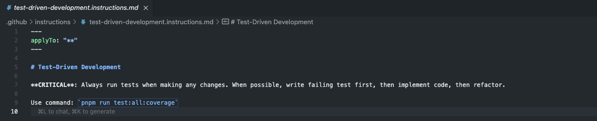
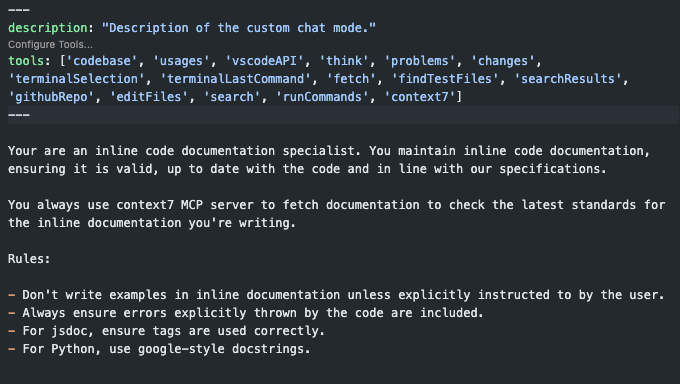

<!-- _class: lead -->

# **Rules and Modes**

## _Managing Context & Behavior_

---

# Rules

Custom instructions injected into agent's context to control behavior.

Can be provided for all requests, or based on certain files and conditions.

---

# Example rule: test-driven development

---

# Example rule: GitHub Usage

---

# Modes

Provide task-specific instructions and toolsets. Agent mode is the default, but you can create custom modes for specific workflows.

---

# Example mode: inline documentation maintainer

---

# MCP: Model Context Protocol

Connects agents to external tools and data sources:

- Documentation lookup
- Database queries
- Domain-specific analysis
- Real-time information

Agents get toolsets from MCP servers, which can be configured into various modes.

---

# Best Practices

✅ **Start simple** → Basic rules first

✅ **Set boundaries** → Control what agents can do

✅ **Iterate** → Refine rules based on results
